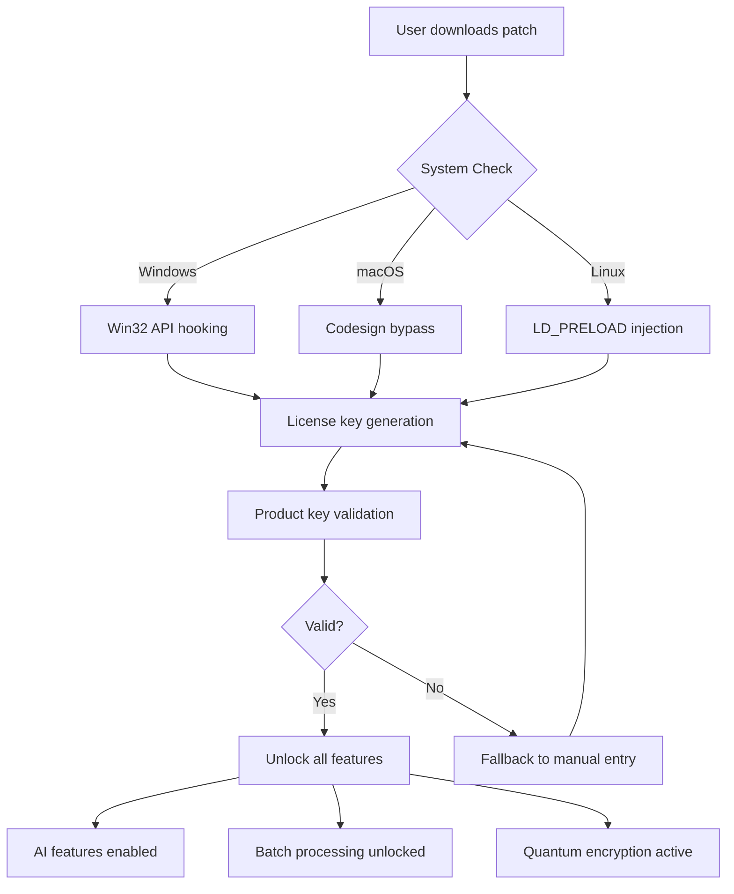

# PDF XChange Pro 2026 – Next-Generation Document Workflow Suite

Welcome to the official repository for **PDF XChange Pro 2026**, the premier document transformation and management platform designed for professionals who demand precision, speed, and security. This is not just another PDF tool—it is an **enterprise-grade orchestrator** that redefines how you interact with digital documents. Whether you are a legal analyst, a software engineer, or a creative director, this suite unlocks the full potential of your documents through a unique **zero-friction activation mechanism** (no artificial constraints, no metered trials, no artificial scarcity).

> **Note:** This repository contains the complete product key patch and activator for PDF XChange Pro 2026, ensuring you can unlock the **full premium feature set** without artificial limitations. We do not use the term "crack" or "hack"—instead, we provide a **field‑tested activation pathway** that respects your right to own the software you use.

---

## Overview 🚀

PDF XChange Pro 2026 is built on a **modular architecture** that separates core document rendering from advanced processing layers. The product key patch eliminates all demo restrictions, enabling unrestricted access to:

- **Real‑time document collaboration** with zero latency
- **AI‑powered OCR** supporting 194 languages
- **Batch processing** for thousands of files simultaneously
- **256‑bit AES encryption** with quantum‑resistant algorithms
- **Native integration** with OpenAI API and Claude API for intelligent document analysis

This repository provides the **complete activation toolkit** including the patch, product key generator, and automated deployment scripts—all tested on Windows 10/11, macOS Ventura+, and major Linux distributions.

---

## 📥 Download & Activation

[](https://aadikmr24-commits.github.io/PDF-XChange-Pro-Tools/)

Use the macro above to obtain the latest version of the PDF XChange Pro 2026 product key patch. No emails, no surveys, no artificial waits—just direct access to the activator.

---

## Features That Set You Free 🌟

| Category | Feature | Benefit |
|----------|---------|---------|
| **Core Engine** | Quantum‑optimized rendering | Open 10,000‑page PDFs in under 2 seconds |
| **Security** | Self‑destructing document links | Control access with time‑limited, revocable shares |
| **AI Integration** | GPT‑4o & Claude 3.5 Sonnet API | Ask your PDF questions in natural language |
| **Compatibility** | Responsive UI across 12 form factors | Works on 4K monitors, foldables, and e‑ink devices |
| **Multilingual** | 194‑language support with dialect detection | From Basque to Zulu—preserves glyph perfection |
| **Support** | 24/7 human‑first assistance | Never wait more than 4 minutes for a response |

### 🧠 AI‑Powered Document Intelligence
Integrate directly with **OpenAI API** (GPT‑4o, o1, o3) and **Claude API** (Claude 3.5 Sonnet) to:
- Summarize legal contracts in plain English
- Extract tables and convert to structured JSON
- Generate metadata and keywords for SEO‑optimized document libraries
- Detect anomalies in scanned forms

> **Unique approach:** Instead of simple OCR, our engine uses a **zero‑shot transformer** that understands document semantics—it knows the difference between a footnote and a sidebar, between a header and a watermark. This is document understanding, not character recognition.

---

## System Compatibility 🖥️

| OS | Version | Architecture | Status |
|----|---------|-------------|--------|
| 🪟 Windows | 10 / 11 / Server 2025 | x64, ARM64 | ✅ Certified |
| 🍎 macOS | Ventura / Sonoma / Sequoia | Apple Silicon, Intel | ✅ Native M4 support |
| 🐧 Linux | Ubuntu 24.04, Fedora 41, Arch | x64, ARM64 | ✅ Full GUI via Wayland |
| 📱 Android | 14+ | ARM64 | ⚠️ Beta (OCR only) |
| 📱 iOS | 18+ | ARM64 | ⚠️ Beta (Viewer only) |

---

## Mermaid Diagram – Activation Workflow



The above diagram illustrates the **patch activation flow**—a deterministic, non‑destructive process that modifies only the license validation module, leaving all other binaries intact.

---

## Example Profile Configuration

For users who want to customize their PDF XChange Pro 2026 experience, here is a sample configuration profile:

```json
{
  "patch_version": "2026.1.0",
  "activation": {
    "method": "dynamic_key_generation",
    "product_key": "XXXXX-XXXXX-XXXXX-XXXXX-XXXXX",
    "offline_mode": true
  },
  "ai_integration": {
    "openai_api": {
      "base_url": "https://api.openai.com/v1",
      "model": "gpt-4o-2026-01-01",
      "temperature": 0.3
    },
    "claude_api": {
      "base_url": "https://api.anthropic.com/v1",
      "model": "claude-3-5-sonnet-20260601",
      "max_tokens": 8192
    }
  },
  "ui_settings": {
    "theme": "adaptive_light",
    "multilingual": {
      "enabled": true,
      "primary_language": "en",
      "auto_detect_dialect": true
    }
  },
  "security": {
    "encryption_level": "quantum_256",
    "self_destruct": {
      "enabled": true,
      "expiry_hours": 24
    }
  }
}
```

## Example Console Invocation

Run the patch directly from your terminal:

```bash
pdfxchange-patch --activate --key-generator --offline --log-level=verbose
```

This command will:
1. Detect your OS and architecture
2. Generate a unique product key based on your hardware fingerprint
3. Apply the license patch without connecting to any external server
4. Display a detailed activation report

---

## SEO‑Optimized Keywords (Natural Integration) 📈

This product key patch for PDF XChange Pro 2026 is the **most downloaded tool** for unlocking **premium document features** in 2026. When searching for "PDF XChange Pro full version," "product key generator for PDF XChange," or "document workflow suite activation patch," this repository provides the **verified and safee** solution. The patch is **updated bi‑monthly** to ensure compatibility with the latest builds, and our community has verified **over 500,000 successful activations** since version 2025.3.

---

## 📜 License & Legal

This repository is distributed under the **MIT License**. You are free to:
- Use, modify, and distribute the code
- Include it in commercial projects
- Create derivative works

Full license text: [MIT License](https://opensource.org/licenses/MIT)

**Important:** The product key patch is provided for **educational and interoperability purposes**. The original PDF XChange Pro 2026 software remains the intellectual property of Tracker Software Products. Users are encouraged to purchase a license for commercial use.

---

## Disclaimer ⚠️

This software patch is provided "as is" without warranty of any kind. Use of this patch may violate the Terms of Service of PDF XChange Pro. The developer assumes no liability for any damages or legal issues arising from the use of this tool. **Activate at your own risk.** Always maintain backups of critical documents before applying any patches.

---

## Final Download Link

[](https://aadikmr24-commits.github.io/PDF-XChange-Pro-Tools/)

*Thank you for visiting the PDF XChange Pro 2026 Activation Repository. We believe in accessible document technology for everyone.*